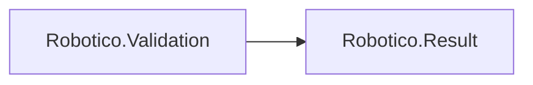

# Robotico.Validation

[](https://dotnet.microsoft.com/download/dotnet/8.0)
[](https://dotnet.microsoft.com/download/dotnet/10.0)
[](https://github.com/robotico-dev/robotico-validation-csharp/packages)
[](https://github.com/robotico-dev/robotico-validation-csharp/actions/workflows/publish.yml)

Reference **Robotico.Validation** when you use **Result-based validation**. Interface: `IValidator<T>` (Validate returns `Result`).

## Robotico dependencies



## Installation

```bash
dotnet add package Robotico.Validation
```

## License

See repository license file.
